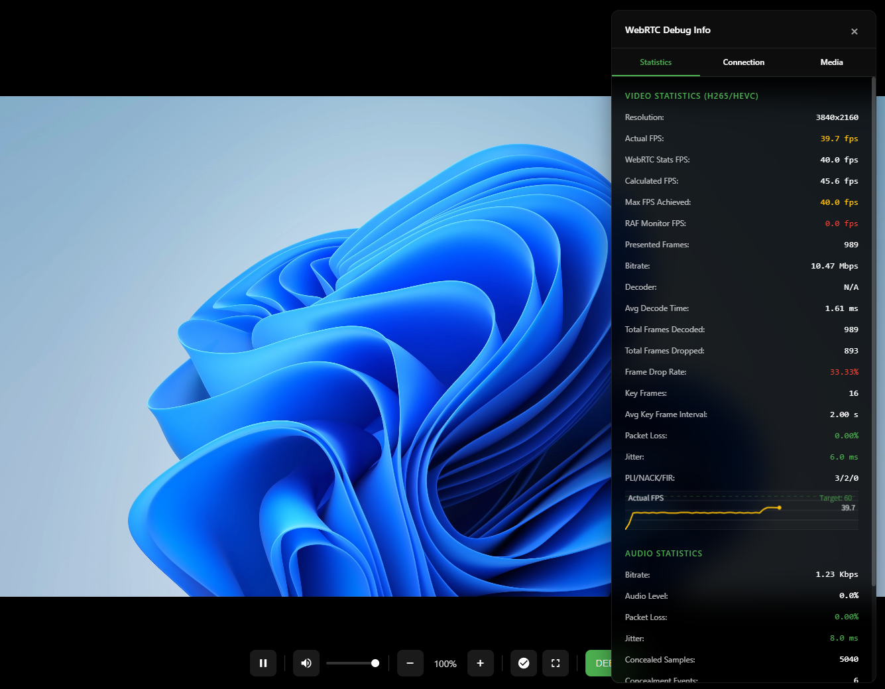
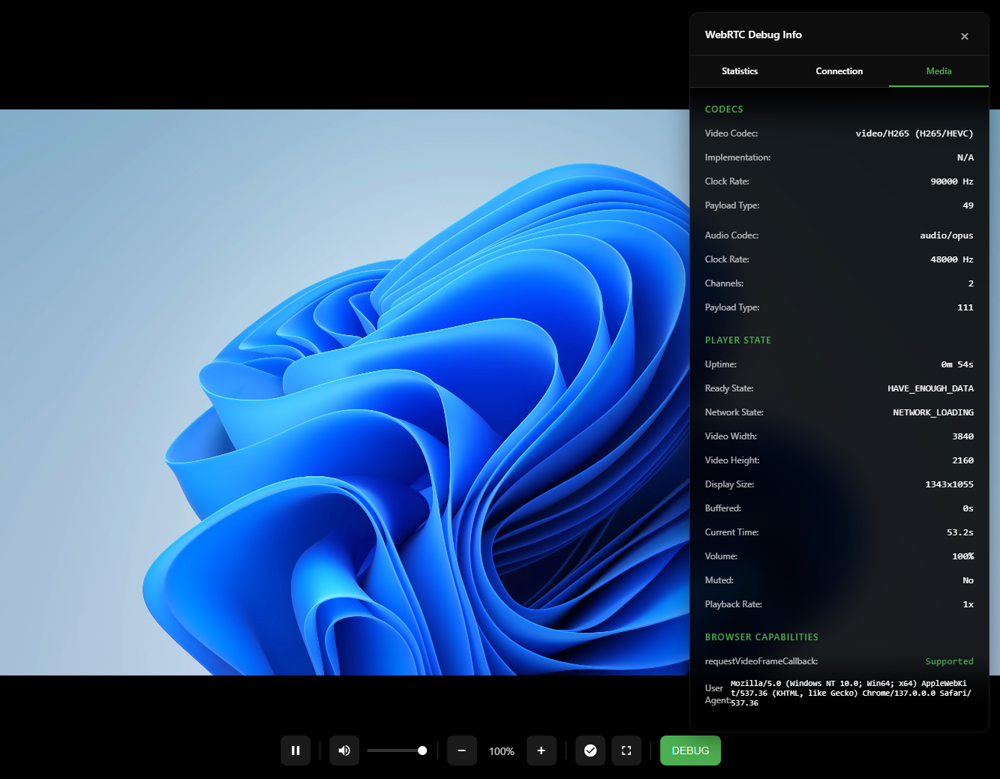

# simple-webrtc-streaming

**simple-webrtc-streaming** is a fork of [SRS (Simple Realtime Server)](https://github.com/ossrs/srs) focused on low-latency streaming via WebRTC. It comes with a sleek Web UI and optimized configuration for real-time broadcasting with 500ms–1000ms latency.

## ✨ Features

* 📡 **WebRTC-based low latency streaming** (500ms–1000ms)
* 🔁 **RTMP input support** for compatibility with OBS and other streamers
* 🖥️ **Modern Web UI** for watching streams directly in your browser
* ⚙️ **Preconfigured SRS settings** for fast setup
* 🌐 **HTTPS-ready reverse proxy example**


## 📸 Screenshots
| | | |
| :---: | :---: | :---: |
|  |   |  |

---

## 🚀 Getting Started

### 1. Clone the repository

```bash
git clone https://github.com/fa0311/simple-webrtc-streaming
cd simple-webrtc-streaming
```

### 2. Build SRS

```bash
cd srs/trunk
./configure
make
cp objs/nginx/html/players/js/srs.sdk.js ../../html/players/srs.sdk.js
cp objs/nginx/html/favicon.ico ../../html/favicon.ico
```


### 3. Start the SRS server

```bash
CANDIDATE="192.168.1.10"
./objs/srs -c ../../rtc.conf
```

---

## ⏸️ Stop the server

```bash
./etc/init.d/srs stop
```

## 🌍 Reverse Proxy (Optional)

You can serve the Web UI and API over HTTPS using Nginx. Here’s an example configuration:

```nginx
server {
    server_name _;

    location ~ ^/(api|rtc)/ {
        proxy_pass http://127.0.0.1:1985$request_uri;
    }

    location / {
        proxy_pass http://127.0.0.1:1986$request_uri;
    }

    listen 443 ssl http2;

    ssl_certificate      /path/to/fullchain.pem;
    ssl_certificate_key  /path/to/privkey.pem;
}
```

---

## 🎥 Streaming via RTMP

Use OBS or any RTMP-compatible tool with the following settings:

* **Service**: Custom
* **Server**: `rtmp://localhost/live`
* **Stream Key**: `livestream`

The stream will be available via WebRTC with ultra-low latency through the Web UI.

> [!WARNING]
> When streaming with OBS or similar tools, make sure to select **Low Latency** or **Ultra Low Latency** mode.  

---

## 📷 Web UI

Navigate to your deployed URL in a browser to access the Web UI. It supports WebRTC playback with minimal delay and provides an elegant viewing experience.
